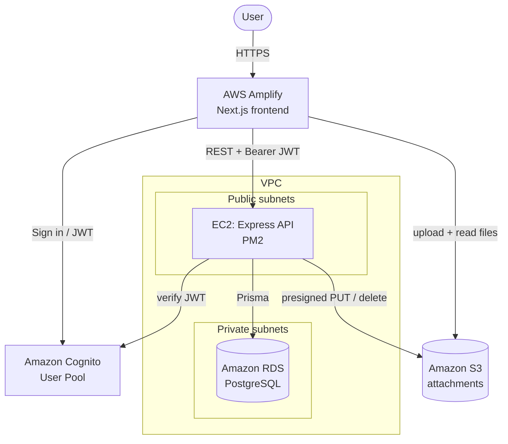

# Deployment Guide

This project deploys entirely on AWS and is provisioned with Terraform
(`infra/terraform`). You can bring the stack up for a demo and tear it back down
to **$0** when you're done.

## Architecture



## Prerequisites

- An AWS account and the AWS CLI configured (`aws configure`).
- [Terraform](https://developer.hashicorp.com/terraform/install) >= 1.5.
- Node.js 20+.

## 1. Provision the infrastructure

```bash
cd infra/terraform
cp terraform.tfvars.example terraform.tfvars   # edit values
export TF_VAR_db_password='a-strong-password'

terraform init
terraform apply
terraform output          # note the IDs/URLs below
```

Key outputs:

- `api_public_url` — base URL of the API.
- `cognito_user_pool_id`, `cognito_user_pool_client_id` — for the frontend.
- `rds_endpoint`, `s3_bucket_name`.

The EC2 `user_data` script installs Node, clones the repo, writes the server
`.env`, runs `prisma migrate deploy`, builds, and starts the API under PM2 — so
the backend is live once the instance finishes booting.

## 2. Configure & deploy the frontend

If you supplied a GitHub repo + token, Amplify is provisioned automatically and
builds from `client/`. Otherwise, set these env vars wherever you host the
frontend (Amplify, Vercel, S3+CloudFront):

```
NEXT_PUBLIC_API_BASE_URL=<api_public_url>
NEXT_PUBLIC_COGNITO_USER_POOL_ID=<cognito_user_pool_id>
NEXT_PUBLIC_COGNITO_USER_POOL_CLIENT_ID=<cognito_user_pool_client_id>
```

## 3. Run the database migrations (if not done by user_data)

```bash
cd server
DATABASE_URL=postgresql://pmadmin:<password>@<rds_endpoint>/project_management npx prisma migrate deploy
npm run seed   # optional sample data
```

## Tear down (back to $0)

```bash
cd infra/terraform
terraform destroy
```

This deletes EC2, RDS (no final snapshot), S3, Cognito and the VPC — returning
the account to zero ongoing cost. Re-`apply` whenever you need the demo live.

## Local development

See the root [README](README.md#local-development) — the API runs against any
PostgreSQL (local, Neon, Supabase) with `AUTH_ENABLED=false`.
