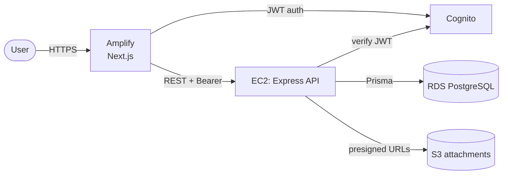

# ProjectManagement-App

A full-stack project management tool (Jira/Trello-style) to plan work, track
tasks across boards, and keep teams aligned. Create projects, manage tasks with
priorities and assignees, comment and attach files, and view work as a board,
list, table, or timeline.

Built as a demonstration of an end-to-end **AWS** deployment provisioned with
**Terraform** — see [Architecture](#architecture) and [DEPLOY.md](DEPLOY.md).

## Tech stack

- **Frontend:** Next.js 16, React 19, TypeScript, Tailwind, Redux Toolkit + RTK Query, MUI, react-dnd, Recharts.
- **Backend:** Node.js, Express 5, TypeScript, Prisma 7, Zod validation.
- **Database:** PostgreSQL (Amazon RDS).
- **Auth:** Amazon Cognito (JWT verified server-side).
- **Storage:** Amazon S3 (presigned uploads for attachments).
- **Hosting:** AWS Amplify (frontend) + EC2 (API), all via Terraform.

## Architecture



Infrastructure is defined in [`infra/terraform`](infra/terraform); the full
diagram and deploy/teardown steps are in [DEPLOY.md](DEPLOY.md).

## Features

- **Projects** — create, view, update, delete (cascades dependent data).
- **Tasks** — full CRUD, drag-and-drop status board, priority pages, list/table/timeline views.
- **Comments** — threaded per task.
- **Attachments** — direct-to-S3 uploads via presigned URLs.
- **Teams** — create teams and assign them to projects.
- **Search** — across tasks, projects, and users.
- **Auth** — Cognito sign-up/in; API protected by JWT verification.

## Local development

Requirements: Node.js 20+, a PostgreSQL database (local, Neon, or Supabase).

### Backend

```bash
cd server
cp .env.example .env          # set DATABASE_URL, keep AUTH_ENABLED=false
npm install
npx prisma migrate deploy
npm run seed                  # optional sample data
npm run dev                   # API on http://localhost:8000
```

### Frontend

```bash
cd client
npm install
# set NEXT_PUBLIC_API_BASE_URL=http://localhost:8000 in .env.local
npm run dev                   # app on http://localhost:3000
```

### Tests & checks

```bash
cd server && npm test         # unit tests (node:test)
cd server && npm run typecheck
cd client && npx tsc --noEmit
```

## API reference

| Method | Route | Description |
|--------|-------|-------------|
| GET/POST | `/projects` | List / create projects |
| GET/PATCH/DELETE | `/projects/:id` | Read / update / delete a project |
| GET/POST | `/tasks` | List by `projectId` / create |
| PATCH | `/tasks/:taskId` | Update task fields |
| PATCH | `/tasks/:taskId/status` | Move task between statuses |
| DELETE | `/tasks/:taskId` | Delete a task |
| GET | `/tasks/user/:userId` | Tasks authored by / assigned to a user |
| GET/POST/PATCH/DELETE | `/comments` `/comments/:id` | Comment CRUD |
| GET/POST/DELETE | `/attachments` | List / create / delete attachments |
| POST | `/attachments/presign` | Get a presigned S3 upload URL |
| GET/POST | `/users` | List / create users |
| GET/PATCH | `/users/:cognitoId` | Read / update a user profile |
| GET/POST | `/teams` | List / create teams |
| POST | `/teams/assign` | Assign a team to a project |
| GET | `/search?query=` | Search tasks, projects, users |
| GET | `/health` | Health check |

All resource routes require a valid Cognito Bearer token when `AUTH_ENABLED=true`.

## Deployment

See [DEPLOY.md](DEPLOY.md) — `terraform apply` to go live, `terraform destroy`
to return to $0.

## Roadmap

- Analytics dashboards for velocity and bottlenecks.
- Role-based access control.
- Notifications and integrations (Slack, email, calendar).
